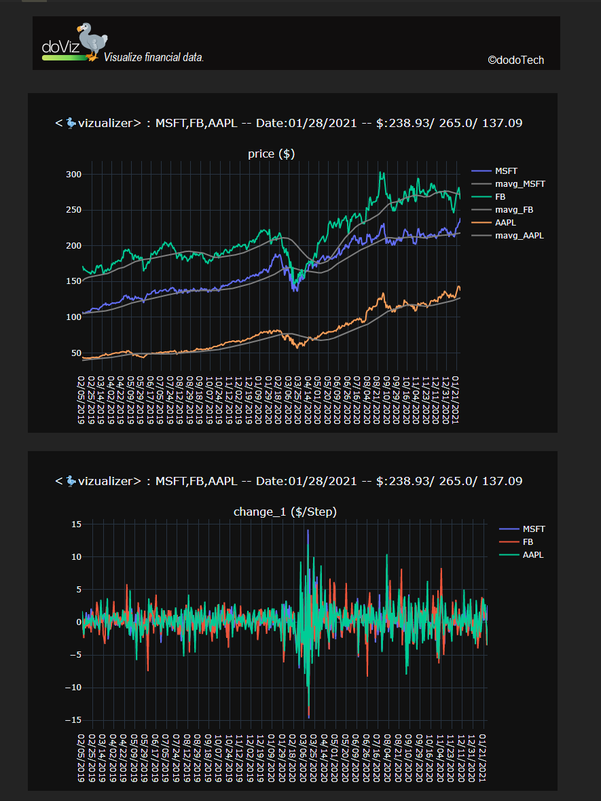
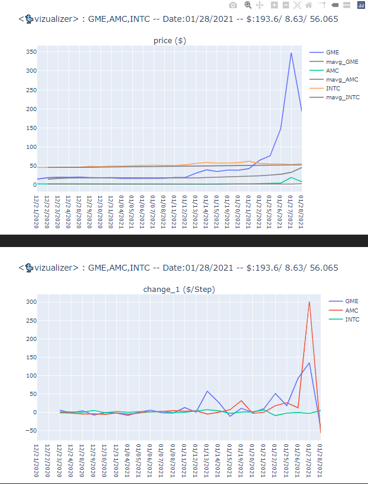
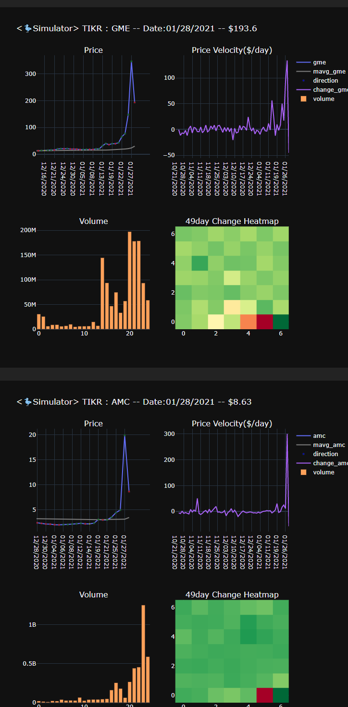
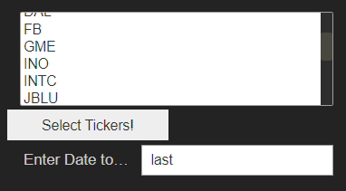

## Financial Data Visualization using doViz (Beta1.0)

doViz (dodo🦤Visualizer) is an open source financial data visualization tool from tradingDodo.
- doViz can represent any sequential/streaming data with or without timestamp
- doViz can be used to analyze local time-series CSV files by analyzing them sequentially
- currently in doViz beta1.0 we are starting with visualizing financial data

## Installation
Currently we are on Beta only, hence you can clone our repo and start using doviz. We'll be releasing API's for realtime data visualization pretty soon.

## Using doviz for visualizing historical price data
The following content has information on how to use the basic version of doviz. In this beta version of doviz, you can visualize your data you have as csv files.

We first need to import doviz
```python
from doviz import pricedatalayer as player
```

We can then define a historical price layer for a stock and call getPrice() everytime to get the next recorded price of the stock. 

```python
ph = player.priceHistorical("AAPL",20)
for tstamp in range(5):
    print("price %s" %ph.getPrice())
```
You should be seeing something like:
    price ['12/30/2020', 133.72, 96452120] 
    price ['12/31/2020', 132.69, 99116590] 
    price ['01/04/2021', 129.41, 143301900] 
    price ['01/05/2021', 131.01, 97664900]
    price ['01/06/2021', 126.6, 155088000]

NOTE: The priceHistorical module makes us of the folder **tickerdata**, the prices of only those stocks are usable by the module whose price data is available inside the tickerdata folder. It returns the timestamp followed by the price and volume. If volume isn't available it will not be returned.

### Analyzing Historical daily free data from NASDAQ
Historical daily data from NASDAQ work perfectly with the historical price module. Since the authors of the repo used NASDAQ daily data for the work, they made sure any downloaded data from their page works. An example of data is available in the link below. 
https://www.nasdaq.com/market-activity/stocks/aapl/historical 
Additional stock price data available. You can download all stock data you are interested in, add their CSV files inside the tickerdata folder, and then run the script below to see which Tickers you collected.
Some, ticker files collected have been included in the repo, but the data will not be the latest data.
```python
#FUNCTION to get all TICKER's as a list from the tickerdata folder 
import glob
def getalltickers():
    alltickers = []
    for el in glob.glob("tickerdata/*.csv"):
        tmp = el.split("\\")[1]
        finx= tmp.split(".")[0]
        alltickers.append(finx)
    return alltickers

print(getalltickers())
```

#### Defining a priceDataLayer from a date
in _player.priceDataLayer("01/12/2018",0.5)_
priceDataLayer stores information of multiple tickers, and hence we need to define these thigs here:
- **date_of_visualization_start** =  (%m/%d/%Y) eg. "01/12/2018", please note that if a trading data on a date is not available, mostly because its a Saturday/Sunday, you'll get an error saying "this day is untraded". In that case you can add or subtract days till you don't get the error anymore.
- **refresh_seconds** = 0.5, which means after every 0.5seconds the prices of all the tickers will be refresged

in _pdl.addTickers(["UAL","DAL","JBLU"],[-1])_
- **tickerList** = the tickers you want to visualize
- **priceContext** = every time the new price is pulled, the ratio of the new to old price is stored as an element in the price-vector

#### Adding tickers to priceDataLayer
In the example below we add _"UAL","DAL","JBLU"_ as tickers and we also add priceContext of 1

#### priceDataLayer.visualize 
visualize is the primary function inside priceDataLayer. It has two modes,
- _allplots_ : Shows (price, price velcity, volume bars, change heatmaps); Detached plots, i.e. if you enter 5 tickers you'll get 5 plots.
- _priceonly_ : Shows (price, price velocity) for all tickers in a single plot.
(With time we'll be adding more kinds of visualizations)

#### Visualizing prices of MSFT, AAPL, FB since 01/12/2018
- We define a priceDataLayer starting from 01/12/2018
- Add tickers MSFT, AAPL, FB (if any ticker isnt available on the day, it won't be displayed)
- (Optional) setting dark mode to True.
- We visualize with mode 'priceonly'

```python
pdl = player.priceDataLayer("01/10/2019",1)
pdl.addTickers(["MSFT","FB","AAPL"],[-1]) 
pdl.setDarkMode(True)
pdl.visualize("priceonly")
```
The above code should start a window, which refreshes after every 1 second. The end result should look like this:


Now, lets try to see what happened to Gamestop this week? 01/31/2021
Unfortunately we don't have the second by second data for the day of the spike, but regardless, we can see the crazy activity over the last week, and the spike of 300%.
```python
pdl = player.priceDataLayer("12/21/2020",0.5)
pdl.setDarkMode(False)
pdl.addTickers(["GME","AMC","INTC"],[-1]) 
pdl.visualize("priceonly")
```


Now, lets look at the volume data as well, by selecting parameter "allplots" for the function visualize.
```python
pdl = player.priceDataLayer("10/21/2020",0.1)
pdl.setDarkMode(True)
pdl.addTickers(["GME","AMC"],[-1]) 
pdl.visualize("allplots")
```


### Creating a dashboard for analysis of price data using doviz and ipywidgets
Here we have tries creating a simple dashboard, that retrieves the stock data ticker from your tickerdata folder and then creates a drop down menu
Run the code below to get to the dashboard
```python
from ipywidgets import interact, widgets
from IPython.display import display
import glob
from doviz import pricedatalayer as priceDataLayer

#function to retrieve all available tickers, before populating drop down menu
def getalltickers():
    alltickers = []
    for el in glob.glob("tickerdata/*.csv"):
        tmp = el.split("\\")[1]
        finx= tmp.split(".")[0]
        alltickers.append(finx)
    return alltickers

global_variables = list(globals().keys())
allops = getalltickers()

global_vars = widgets.SelectMultiple(
    options=allops)

butt = widgets.Button(description='Select Tickers!')
outt = widgets.Output()

text = widgets.Text(
    value='last',
    placeholder='Enter Simulation start date!',
    description='Enter Date to start Simulation!:',
    disabled=False
)
selectedTickers = None

def assignselected(stickers):
    print("Tickers to analyze:",stickers)
    global selectedTickers
    selectedTickers = stickers

def on_butt_clicked(b):
    with outt:
        clear_output()
        selectedTickers = list(global_vars.value)
        assignselected(selectedTickers)
        
def callback(wdgt):
    global selectedTickers
    datex = wdgt.value
    pdl = priceDataLayer.priceDataLayer(datex,1)
    pdl.setDarkMode(False)
    pdl.addTickers(selectedTickers,[-1]) #tickerpricelayerdays
    pdl.visualize("all")

text.on_submit(callback)
butt.on_click(on_butt_clicked)
widgets.VBox([global_vars,butt,outt,text])
```
This should give you a menu like this when you run the code. You can try creating a different dashboard

Alternatively, the module for button and menu based running is being added to doviz for more flexibility and easier usage.
